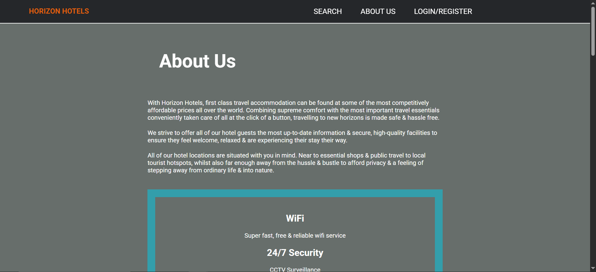
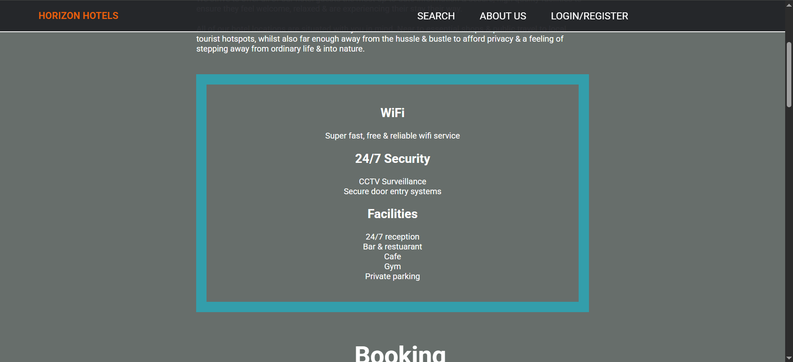

# Horizon Hotels

A hotel booking website built with Flask and Python.

## Getting Started

Follow these steps to run the project locally.

### 1. Clone this repository

```bash
git clone https://github.com/vee-b/horizon-hotels.git 
cd horizon-hotels
```

### 2. Create a Virtual Environment

```bash
python -m venv venv
source venv/bin/activate  # or venv\Scripts\activate on Windows
```

### 3. Install dependencies

```bash
pip install -r requirements.txt
```

### 3. Run the app

```bash
python flsk.py
```

### 4. Navigate to the home page

Once the app is running, open your browser and go to:

[http://127.0.0.1:5000/searchPage](http://127.0.0.1:5000/searchPage)


> ⚠️ Requires **Python 3.9+**

### To check your version:

```bash
python --version
```

## Screenshots

   

  

  

  

  

  

  

  

  

  

  

  

  

  

  

  

  

  

  

  

  

  

  

  

  

**Note:** This project was created as part of my personal portfolio and is not open to external contributions at this time.
